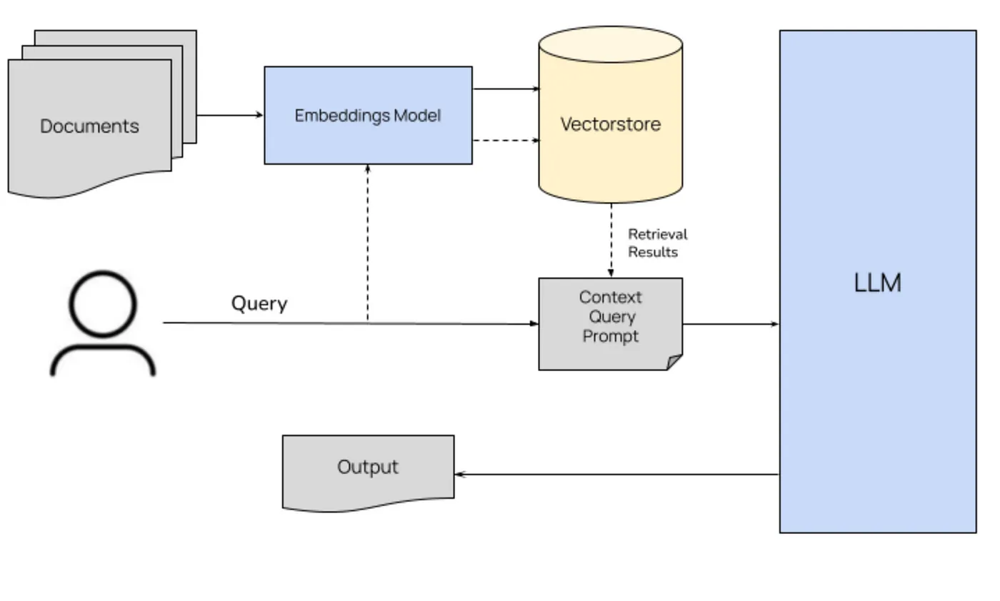

### InsightPro: Retrieval Augmented Generation (RAG) based Contextual Chat Bot  

##### Tools Used

- LLMs: LLaMA2, LLaMA3.1
- Vector DB: Milvus
- Embeddings: HuggingFaceEmbeddings
- Langchain, Langsmith
- Ollama
- FastAPI


##### RAG Architecture



### Setup

#### Pre-requisite:
```
git clone git@github.com:karanyadav14/qp-ai-assessment.git
cd qp-ai-assessment
ENV_NAME=myenv && python3 -m venv $ENV_NAME && source $ENV_NAME/bin/activate && pip install ipykernel && python -m ipykernel install --user --name=$ENV_NAME
pip install -r requirements.txt
uvicorn fastapi_integration:app --reload
```

#### 1. Ollama
```
pip install ollama
ollama pull llama2
ollama pull llama3.1
```

#### 2. Standalone Milvus DB
- Install standalone docker based milvus vector db and keep it running in background: 
```
curl -sfL https://raw.githubusercontent.com/milvus-io/milvus/master/scripts/standalone_embed.sh -o standalone_embed.sh
bash standalone_embed.sh start
```

- If asked for passward, enter system passward for admin access
   


### Launch Chatbot

- Limit size of file upload to 10 MB
```
streamlit run main.py --server.maxUploadSize 10
```


### Demo:

