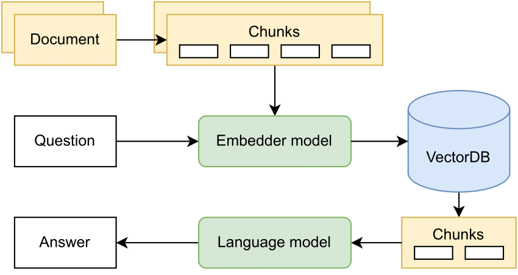

### Retrieval Augmented Generation (RAG) based Contextual Chat Bot  

##### Tools Used

- LLMs: LLaMA2, LLaMA3
- Vector DB: Milvus
- Embeddings: HuggingFaceEmbeddings
- Langchain
- Ollama


##### RAG Architecture



### Setup

#### Standalone Milvus DB
1. Install standalone docker based milvus vector db and keep it running in background: 
```
curl -sfL https://raw.githubusercontent.com/milvus-io/milvus/master/scripts/standalone_embed.sh -o standalone_embed.sh
bash standalone_embed.sh start
```

2. If asked for passward, enter system passward for admin access
   


###  Future scope
1. Upload document via FastAPI and insert it in Milvus Vector DB
2. Evaluate Model
3. Model versioning, monitoring and retrainig pipeline 